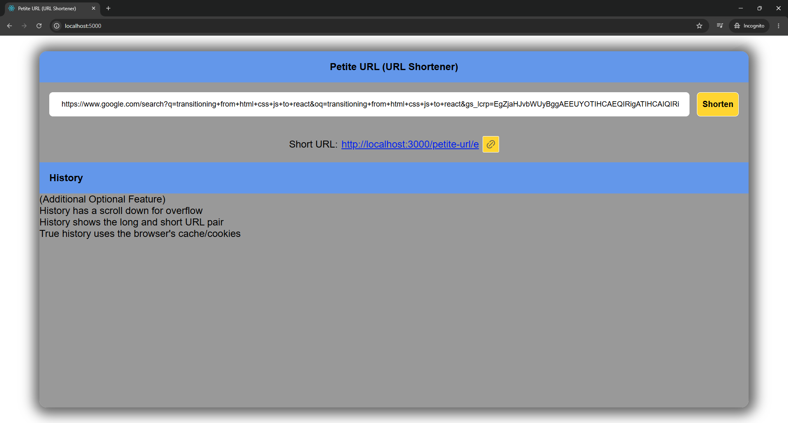
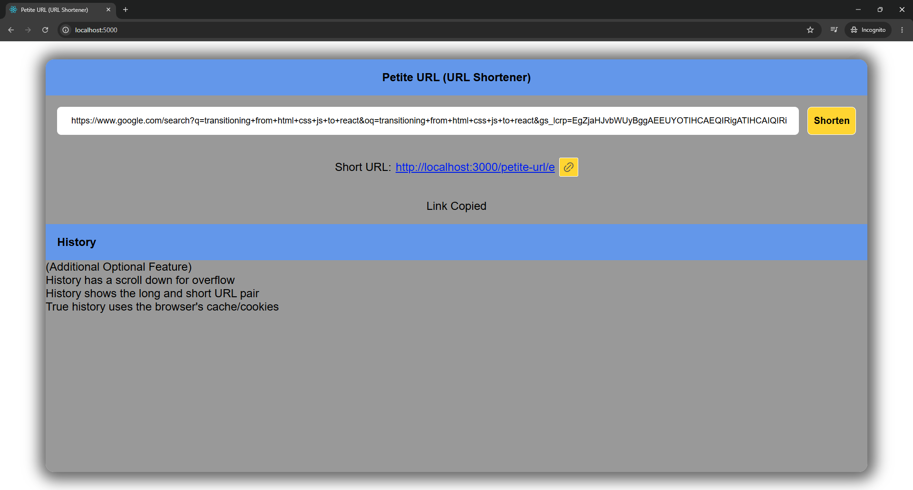

# PetiteURL — URL Shortener

A simple URL shortener web app built as a personal learning project. Frontend was initially built with a Vanilla JS, but was later replicated with React.

<p float="left">
  
  
</p>

## Features

- Converts long URLs into short Base62 codes
- Has basic input validation, i.e. checks for "http://" in URL
- Redirects short URLs to their original destination
- Reuses existing short codes for duplicate URLs
- Button for copying short URL to clipboard

## Tech Stack

- **Frontend:** Vanilla JS, React, TypeScript, Vite
- **Backend:** Node.js, Express
- **Database:** MySQL
- **Encoding:** Base62

## Architecture

```text
Client
   ↓
Server
   ↓
Router
   ↓
Controller
   ↓
Service
   ↓
Repository
   ↓
Database
```

I used a layered architecture to isolate the user interaction, request interception, routing, business logic and data persistence, enforcing modularity and separation of concerns principle.

## Future Works

- Persist frontend URL history
- Add click/redirect analytics
- Add authentication and user-specific URL management
- Add custom aliases
- Add URL expiration
- Add stronger URL validation, error handling
- Add rate limiting
- Add caching layer
- Deploy app
